  

 

### 🧪 The Alchemist's Lore

I am **Babatunde Abu-bakr** (HephtronCode), a **Full-Stack Alchemist** bridging the gap between empathetic **Customer Success** and rigorous **Software Engineering**. I specialize in transforming raw logic and fragmented data into "digital gold"—resilient, user-centric systems that drive real-world impact.

With a background in **Operations** and **McKinsey/UN-certified** leadership, I bring a unique blend of technical mastery and emotional intelligence to every project. Whether I'm architecting enterprise healthcare platforms or forging high-performance data pipelines, my focus is always on **precision**, **scalability**, and **elegant design**.

 

### ⚒️ The Astral Forge
<!-- FORGE_START -->
*Currently forging new code in the deep repositories...*
<!-- FORGE_END -->

 

### 🏺 Arsenal & Masteries

> [!NOTE]
> *“Mastery is not a destination, but a continuous transmutation of base knowledge into expertise.”*

| **Category** | **Elemental Tools & Skills** |
| :--- | :--- |
| **Frontend Craft** |     |
| **Backend Alchemy** |      |
| **Data Engineering** |     |
| **Certifications** |    |

 

### 🕸️ Transmutation Grid (Featured Projects)

<table border="0">
  <tr>
    <td width="50%" valign="top">
      <h4>🏥 Panacea EMR</h4>
      
Modern full-stack hospital management system focused on patient care and clinical compliance.

      <code>React 19</code> <code>Node.js</code> <code>MongoDB</code>
        
      <a href="https://github.com/HephtronCode/panacea-emr-project"><strong>Explore Repo »</strong></a>
    </td>
    <td width="50%" valign="top">
      <h4>🛡️ FinVault Engine</h4>
      
High-performance fraud detection engine for financial transactions and data integrity.

      <code>TypeScript</code> <code>Security</code> <code>Analytics</code>
        
      <a href="https://github.com/HephtronCode/FinVault-Fraud-detection-engine"><strong>Explore Repo »</strong></a>
    </td>
  </tr>
  <tr>
    <td width="50%" valign="top">
      <h4>🤖 codeReviewAgent-007</h4>
      
Automated AI-driven code review agent designed to optimize PR workflows and code quality.

      <code>TypeScript</code> <code>AI/LLM</code> <code>Automation</code>
        
      <a href="https://github.com/HephtronCode/codeReviewAgent-007"><strong>Explore Repo »</strong></a>
    </td>
    <td width="50%" valign="top">
      <h4>💊 Vuzima Pharma Go</h4>
      
Enterprise-grade pharmaceutical operations app with PostgreSQL and Redis orchestration.

      <code>PostgreSQL</code> <code>Redis</code> <code>Docker</code>
        
      <a href="https://github.com/HephtronCode/vuzima-pharmapp"><strong>Explore Repo »</strong></a>
    </td>
  </tr>
  <tr>
    <td width="50%" valign="top">
      <h4>📊 Data Engineering Workshop</h4>
      
Comprehensive pipelines and analytical models showcasing data transformation expertise.

      <code>Python</code> <code>SQL</code> <code>ETL Pipelines</code>
        
      <a href="https://github.com/HephtronCode/data-engineering-workshop"><strong>Explore Repo »</strong></a>
    </td>
    <td width="50%" valign="top">
      <h4>🐶 Tiny Tama</h4>
      
Spec-driven digital pet MVP utilizing browser-native SQLite (Wasm/OPFS) for persistence.

      <code>SQLite Wasm</code> <code>Framer Motion</code> <code>SDD</code>
        
      <a href="https://github.com/HephtronCode/tiny-tama-mvp-final"><strong>Explore Repo »</strong></a>
    </td>
  </tr>
</table>

 

### 📈 Alchemical Insights

  
  

 

### 🔗 Connect with The Alchemist

  
  
  
  

 

  Built by <strong>The Maestro</strong> for <strong>HephtronCode</strong>. Transmuted on April 28, 2026.

