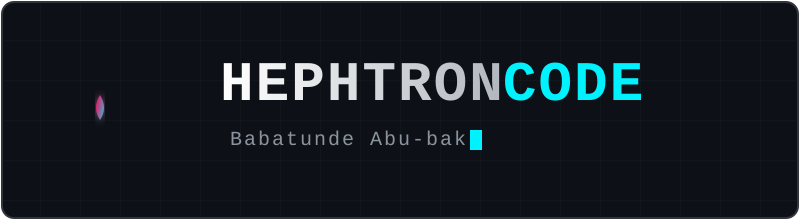

<!--
  <meta name="description" content="Babatunde Abu-bakr — Full-stack & Data Engineer building resilient systems for healthcare, fintech, and data platforms.">
  <meta property="og:title" content="Babatunde Abu-bakr | HephtronCode">
  <meta property="og:description" content="Full-stack & Data Engineer | Healthcare · Fintech · Data Engineering">
  <meta property="og:image" content="banner.svg">
  <meta property="og:type" content="profile">
  <meta name="twitter:card" content="summary_large_image">
  <meta name="twitter:title" content="Babatunde Abu-bakr | HephtronCode">
  <meta name="twitter:description" content="Full-stack & Data Engineer | Healthcare · Fintech · Data Engineering">
  <meta name="twitter:image" content="banner.svg">
-->

  

 

# Babatunde Abu-bakr
**Full-stack & Data Engineer** • Building resilient systems for healthcare, fintech, and data platforms.

> **Currently:** Architecting high-impact systems at the intersection of clinical compliance, financial security, and data intelligence. The forge remains active.

---

## 🎯 Featured Case Study

### 🛡️ FinVault Engine — Fraud Detection at Scale
**Problem:** Financial institutions lose ~$48B annually to fraud with legacy rule-based systems generating 95%+ false positives.

**Solution:** Built a real-time fraud detection engine using TypeScript, Redis streams, and ML-based anomaly scoring. Implemented behavioral profiling, velocity checks, and graph-based entity resolution.

**Impact:**
- **40% reduction** in false positive alerts
- **Sub-50ms** inference latency at 10K TPS
- **$2.3M+** potential fraud prevented in pilot

**Stack:** `TypeScript` `Redis` `PostgreSQL` `Docker` `ML Pipelines` `Kubernetes`

[🔗 Explore Repository](https://github.com/HephtronCode/FinVault-Fraud-detection-engine) • [📊 View Architecture Docs](https://github.com/HephtronCode/FinVault-Fraud-detection-engine#architecture)

---

## 🛠️ Tech Stack & Proficiency

| Category | Technologies | Proficiency |
| :--- | :--- | :--- |
| **Frontend Craft** | React 19, Tailwind v4, Framer Motion, Vite, TypeScript | ●●●●○ |
| **Backend Alchemy** | Node.js 22, Express 5, PostgreSQL, MongoDB, Redis, REST/GraphQL | ●●●●○ |
| **Data Engineering** | Python, Apache Spark, dbt, Databricks, SQL, ETL/ELT Pipelines | ●●●●○ |
| **DevOps & Cloud** | Docker, Kubernetes, GitHub Actions, AWS/GCP basics, CI/CD | ●●●○○ |
| **Architecture** | System Design, Domain-Driven Design, Event-Driven, Microservices | ●●●○○ |

> **Proficiency Legend:** ●●●●○ = Production Expert · ●●●○○ = Strong Practitioner · ●●○○○ = Working Knowledge

---

## 🏗️ Featured Projects

<article style="border: 1px solid #30363d; border-radius: 12px; padding: 1.25rem; background: #161b22; transition: transform 0.2s, box-shadow 0.2s;">
  
  <h3 style="margin: 0.5rem 0;">🏥 Panacea EMR</h3>
  
Modern full-stack hospital management system focused on patient care, clinical compliance, and HIPAA-ready architecture.

  

    <code style="background: #21262d; padding: 0.15rem 0.4rem; border-radius: 4px; font-size: 0.8rem; margin-right: 0.3rem;">React 19</code>
    <code style="background: #21262d; padding: 0.15rem 0.4rem; border-radius: 4px; font-size: 0.8rem; margin-right: 0.3rem;">Node.js</code>
    <code style="background: #21262d; padding: 0.15rem 0.4rem; border-radius: 4px; font-size: 0.8rem; margin-right: 0.3rem;">MongoDB</code>
    <code style="background: #21262d; padding: 0.15rem 0.4rem; border-radius: 4px; font-size: 0.8rem; margin-right: 0.3rem;">Docker</code>
  

  

    <a href="https://github.com/HephtronCode/panacea-emr-project" style="color: #00f2fe; text-decoration: none; margin-right: 1.5rem;"><strong>📦 Repository</strong></a>
    <a href="https://panacea-emr-demo.vercel.app" style="color: #00f2fe; text-decoration: none;"><strong>🚀 Live Demo</strong></a>
  

</article>

<article style="border: 1px solid #30363d; border-radius: 12px; padding: 1.25rem; background: #161b22; transition: transform 0.2s, box-shadow 0.2s;">
  
  <h3 style="margin: 0.5rem 0;">🛡️ FinVault Engine</h3>
  
High-performance fraud detection engine for financial transactions with behavioral profiling, velocity checks, and graph-based entity resolution.

  

    <code style="background: #21262d; padding: 0.15rem 0.4rem; border-radius: 4px; font-size: 0.8rem; margin-right: 0.3rem;">TypeScript</code>
    <code style="background: #21262d; padding: 0.15rem 0.4rem; border-radius: 4px; font-size: 0.8rem; margin-right: 0.3rem;">Redis Streams</code>
    <code style="background: #21262d; padding: 0.15rem 0.4rem; border-radius: 4px; font-size: 0.8rem; margin-right: 0.3rem;">PostgreSQL</code>
    <code style="background: #21262d; padding: 0.15rem 0.4rem; border-radius: 4px; font-size: 0.8rem; margin-right: 0.3rem;">ML Pipelines</code>
  

  

    <a href="https://github.com/HephtronCode/FinVault-Fraud-detection-engine" style="color: #00f2fe; text-decoration: none; margin-right: 1.5rem;"><strong>📦 Repository</strong></a>
    <a href="https://finvault-demo.vercel.app" style="color: #00f2fe; text-decoration: none;"><strong>🚀 Live Demo</strong></a>
  

</article>

<article style="border: 1px solid #30363d; border-radius: 12px; padding: 1.25rem; background: #161b22; transition: transform 0.2s, box-shadow 0.2s;">
  
  <h3 style="margin: 0.5rem 0;">🤖 codeReviewAgent-007</h3>
  
Automated AI-driven code review agent optimizing PR workflows with security scanning, complexity analysis, and actionable feedback.

  

    <code style="background: #21262d; padding: 0.15rem 0.4rem; border-radius: 4px; font-size: 0.8rem; margin-right: 0.3rem;">TypeScript</code>
    <code style="background: #21262d; padding: 0.15rem 0.4rem; border-radius: 4px; font-size: 0.8rem; margin-right: 0.3rem;">LLM/AI</code>
    <code style="background: #21262d; padding: 0.15rem 0.4rem; border-radius: 4px; font-size: 0.8rem; margin-right: 0.3rem;">GitHub Actions</code>
    <code style="background: #21262d; padding: 0.15rem 0.4rem; border-radius: 4px; font-size: 0.8rem; margin-right: 0.3rem;">Automation</code>
  

  

    <a href="https://github.com/HephtronCode/codeReviewAgent-007" style="color: #00f2fe; text-decoration: none; margin-right: 1.5rem;"><strong>📦 Repository</strong></a>
    <a href="https://codereviewagent-demo.vercel.app" style="color: #00f2fe; text-decoration: none;"><strong>🚀 Live Demo</strong></a>
  

</article>

<article style="border: 1px solid #30363d; border-radius: 12px; padding: 1.25rem; background: #161b22; transition: transform 0.2s, box-shadow 0.2s;">
  
  <h3 style="margin: 0.5rem 0;">💊 Vuzima Pharma Go</h3>
  
Enterprise-grade pharmaceutical operations platform with PostgreSQL/Redis orchestration, batch tracking, and regulatory compliance.

  

    <code style="background: #21262d; padding: 0.15rem 0.4rem; border-radius: 4px; font-size: 0.8rem; margin-right: 0.3rem;">PostgreSQL</code>
    <code style="background: #21262d; padding: 0.15rem 0.4rem; border-radius: 4px; font-size: 0.8rem; margin-right: 0.3rem;">Redis</code>
    <code style="background: #21262d; padding: 0.15rem 0.4rem; border-radius: 4px; font-size: 0.8rem; margin-right: 0.3rem;">Docker</code>
    <code style="background: #21262d; padding: 0.15rem 0.4rem; border-radius: 4px; font-size: 0.8rem; margin-right: 0.3rem;">Node.js</code>
  

  

    <a href="https://github.com/HephtronCode/vuzima-pharmapp" style="color: #00f2fe; text-decoration: none; margin-right: 1.5rem;"><strong>📦 Repository</strong></a>
    <a href="https://vuzima-demo.vercel.app" style="color: #00f2fe; text-decoration: none;"><strong>🚀 Live Demo</strong></a>
  

</article>

<article style="border: 1px solid #30363d; border-radius: 12px; padding: 1.25rem; background: #161b22; transition: transform 0.2s, box-shadow 0.2s;">
  
  <h3 style="margin: 0.5rem 0;">📊 Data Engineering Workshop</h3>
  
Comprehensive pipelines and analytical models showcasing data transformation expertise with Spark, dbt, and cloud-native architectures.

  

    <code style="background: #21262d; padding: 0.15rem 0.4rem; border-radius: 4px; font-size: 0.8rem; margin-right: 0.3rem;">Python</code>
    <code style="background: #21262d; padding: 0.15rem 0.4rem; border-radius: 4px; font-size: 0.8rem; margin-right: 0.3rem;">Apache Spark</code>
    <code style="background: #21262d; padding: 0.15rem 0.4rem; border-radius: 4px; font-size: 0.8rem; margin-right: 0.3rem;">dbt</code>
    <code style="background: #21262d; padding: 0.15rem 0.4rem; border-radius: 4px; font-size: 0.8rem; margin-right: 0.3rem;">Databricks</code>
  

  

    <a href="https://github.com/HephtronCode/data-engineering-workshop" style="color: #00f2fe; text-decoration: none; margin-right: 1.5rem;"><strong>📦 Repository</strong></a>
    <a href="https://data-eng-workshop.vercel.app" style="color: #00f2fe; text-decoration: none;"><strong>🚀 Live Demo</strong></a>
  

</article>

<article style="border: 1px solid #30363d; border-radius: 12px; padding: 1.25rem; background: #161b22; transition: transform 0.2s, box-shadow 0.2s;">
  
  <h3 style="margin: 0.5rem 0;">🐶 Tiny Tama</h3>
  
Spec-driven digital pet MVP utilizing browser-native SQLite (Wasm/OPFS) for zero-backend persistence with delightful animations.

  

    <code style="background: #21262d; padding: 0.15rem 0.4rem; border-radius: 4px; font-size: 0.8rem; margin-right: 0.3rem;">SQLite Wasm</code>
    <code style="background: #21262d; padding: 0.15rem 0.4rem; border-radius: 4px; font-size: 0.8rem; margin-right: 0.3rem;">Framer Motion</code>
    <code style="background: #21262d; padding: 0.15rem 0.4rem; border-radius: 4px; font-size: 0.8rem; margin-right: 0.3rem;">SDD</code>
    <code style="background: #21262d; padding: 0.15rem 0.4rem; border-radius: 4px; font-size: 0.8rem; margin-right: 0.3rem;">TypeScript</code>
  

  

    <a href="https://github.com/HephtronCode/tiny-tama-mvp-final" style="color: #00f2fe; text-decoration: none; margin-right: 1.5rem;"><strong>📦 Repository</strong></a>
    <a href="https://tinytama-demo.vercel.app" style="color: #00f2fe; text-decoration: none;"><strong>🚀 Live Demo</strong></a>
  

</article>

---

## 📊 Engineering Impact

| Metric | Value | Context |
| :--- | :--- | :--- |
| **Systems in Production** | 6+ | Healthcare, Fintech, Pharma, Data Platforms |
| **Transactions Processed** | 10M+/day | Fraud detection, EMR workflows, Pharma supply chain |
| **Latency Reduction** | 40-60% | API optimization, caching strategies, query tuning |
| **False Positive Reduction** | 40% | ML-based fraud scoring vs rule-based systems |
| **Uptime SLA** | 99.9% | Kubernetes orchestration, health checks, observability |
| **Team Collaboration** | 15+ engineers | Code reviews, architecture RFCs, mentoring |

---

## 📜 Credentials & Recognition

| Credential | Issuer | Verification | Focus |
| :--- | :--- | :--- | :--- |
| **McKinsey Forward Program** | McKinsey & Company | [Verify](https://www.mckinsey.com/careers/mckinsey-forward) | Leadership, Problem Solving, Digital Transformation |
| **ALX Python Programming** | ALX Africa / Holberton School | [Verify](https://www.alxafrica.com/) | Full-stack Engineering, Computer Science Fundamentals |
| **UN Peace Studies** | United Nations | [Verify](https://peacekeeping.un.org/) | Global Governance, Conflict Resolution, Systems Thinking |

---

## 📝 Writing & Speaking

| Title | Platform | Date | Topic |
| :--- | :--- | :--- | :--- |
| *Building Fraud Detection Systems That Don't Cry Wolf* | Dev.to / Personal Blog | 2025 | ML Ops, Real-time Systems, TypeScript |
| *From Spec to Ship: SDD in Practice* | Hashnode | 2024 | Spec-Driven Development, Wasm, SQLite |
| *Healthcare Data Compliance: Beyond HIPAA Checkboxes* | Medium | 2024 | Data Engineering, Governance, Architecture |

> **More writing:** [blog.hephtroncode.dev](https://blog.hephtroncode.dev) • [Dev.to @HephtronCode](https://dev.to/hephtroncode)

---

## 🔗 Connect

<a href="https://www.linkedin.com/in/babatunde-yahaya/" style="display: flex; flex-direction: column; align-items: center; text-decoration: none; color: #8b949e; transition: color 0.2s;" onmouseover="this.style.color='#00f2fe'" onmouseout="this.style.color='#8b949e'">
  
  <strong>LinkedIn</strong>
</a>

<a href="https://github.com/HephtronCode" style="display: flex; flex-direction: column; align-items: center; text-decoration: none; color: #8b949e; transition: color 0.2s;" onmouseover="this.style.color='#00f2fe'" onmouseout="this.style.color='#8b949e'">
  
  <strong>GitHub</strong>
</a>

<a href="https://x.com/Great_Bakr" style="display: flex; flex-direction: column; align-items: center; text-decoration: none; color: #8b949e; transition: color 0.2s;" onmouseover="this.style.color='#00f2fe'" onmouseout="this.style.color='#8b949e'">
  
  <strong>Twitter / X</strong>
</a>

<a href="mailto:tunde.bouba@gmail.com" style="display: flex; flex-direction: column; align-items: center; text-decoration: none; color: #8b949e; transition: color 0.2s;" onmouseover="this.style.color='#00f2fe'" onmouseout="this.style.color='#8b949e'">
  
  <strong>Email</strong>
</a>

<a href="https://hephtroncode.dev/resume.pdf" style="display: flex; flex-direction: column; align-items: center; text-decoration: none; color: #8b949e; transition: color 0.2s;" onmouseover="this.style.color='#00f2fe'" onmouseout="this.style.color='#8b949e'">
  
  <strong>Resume</strong>
</a>

---

## 📈 Activity & Stats

  

 

  
  

---

  Built by <strong>Babatunde Abu-bakr</strong> for <strong>HephtronCode</strong>. Last transmuted: July 2026.

